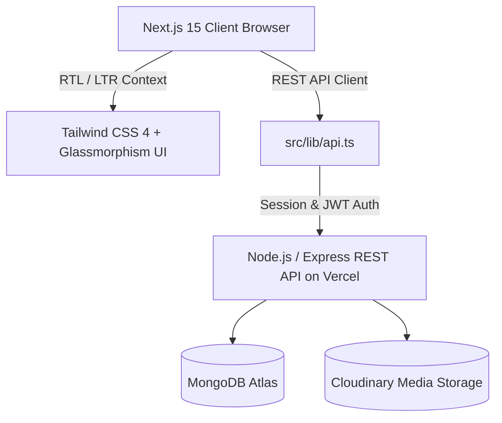

# 👑 SAOUDI WEAR — Luxury Men's Haute Couture & Fine Horology

<div align="center">

```
  ██████╗ █████╗  ██████╗ ██╗   ██╗██████╗ ██╗    ██╗    ██╗███████╗ █████╗ ██████╗ 
 ██╔════╝██╔══██╗██╔═══██╗██║   ██║██╔══██╗██║    ██║    ██║██╔════╝██╔══██╗██╔══██╗
 ╚█████╗ ███████║██║   ██║██║   ██║██║  ██║██║    ██║ █╗ ██║█████╗  ███████║██████╔╝
  ╚═══██╗██╔══██║██║   ██║██║   ██║██║  ██║██║    ██║███╗██║██╔══╝  ██╔══██║██╔══██╗
 ██████╔╝██║  ██║╚██████╔╝╚██████╔╝██████╔╝██║    ╚███╔███╔╝███████╗██║  ██║██║  ██║
 ╚═════╝ ╚═╝  ╚═╝ ╚═════╝  ╚═════╝ ╚═════╝ ╚═╝     ╚══╝╚══╝ ╚══════╝╚═╝  ╚═╝╚═╝  ╚═╝
```

**An uncompromising luxury digital flagship powered by Next.js 15, TypeScript & Tailwind CSS 4**

[](https://nextjs.org/)
[](https://react.dev/)
[](https://www.typescriptlang.org/)
[](https://tailwindcss.com/)
[](https://vercel.com/)
[](LICENSE)

[🌐 Live Storefront](https://saoudi-front.vercel.app/) • [🔌 Backend Repository](https://github.com/Amr-khalid/SaoudiBackend) • [📖 Documentation](#-table-of-contents)

</div>

---

## 📑 Table of Contents

- [✨ Experience & Highlights](#-experience--highlights)
- [🏛️ Architectural Overview](#️-architectural-overview)
- [🛠️ Tech Stack & Dependencies](#️-tech-stack--dependencies)
- [💎 Feature Modules](#-feature-modules)
  - [🛍️ Luxury Storefront](#️-luxury-storefront)
  - [👑 Full CMS & Admin Suite](#-full-cms--admin-suite)
  - [🔒 Authentication & Security](#-authentication--security)
  - [🌍 Globalization & RTL Support](#-globalization--rtl-support)
- [📁 Project Hierarchy](#-project-hierarchy)
- [⚙️ Local Development](#️-local-development)
- [🚀 Vercel Deployment Guide](#-vercel-deployment-guide)
- [🔐 Environment Variables](#-environment-variables)
- [🤝 Contributing & License](#-contributing--license)

---

## ✨ Experience & Highlights

**SAOUDI WEAR** is crafted for the discerning modern gentleman. The digital storefront blends bespoke Italian tailoring, Swiss-inspired horology, and high-performance Web architecture to deliver an ultra-fast, visually immersive e-commerce experience.

* **Ultra-Fast Next.js 15 App Router** with Server and Client components optimized for lightning-speed First Contentful Paint.
* **Curated Luxury Design System** featuring gold accents (`#D4AF37`), deep obsidian dark modes, glassmorphism, and EB Garamond typography.
* **Comprehensive Admin Suite** with real-time analytics, inventory matrices, product catalogs, coupon management, and dynamic homepage CMS control.
* **Fluid Scroll & Micro-Animations** powered by Motion and modern CSS keyframes.

---

## 🏛️ Architectural Overview



---

## 🛠️ Tech Stack & Dependencies

| Category | Technology | Description |
|---|---|---|
| **Framework** | Next.js 15 (App Router) | High-performance React framework with SSR and SSG |
| **UI Library** | React 19 | Latest concurrent React runtime |
| **Language** | TypeScript 5.8 | End-to-end type safety and strict schema validation |
| **Styling** | Tailwind CSS 4 + PostCSS | Modern utility-first stylesheet engine |
| **Icons & Typography** | Google Fonts (EB Garamond & Cairo) + Material Symbols | Editorial serif and Arabic typography |
| **Animations** | Motion 12 + CSS Keyframes | Hardware-accelerated transitions & layout animations |
| **State Management** | React Context API | Global Cart, Auth, Language & Currency state |
| **Hosting & CI/CD** | Vercel | Global Edge Network & Serverless Function deployment |

---

## 💎 Feature Modules

### 🛍️ Luxury Storefront
* **Dynamic Hero Slider:** Immersive editorial slides with custom CTAs.
* **Curated Bento Grid:** Visual masonry showcase of flagship collections.
* **Flash Sale Engine:** Live countdown timers with real-time stock indicators.
* **Quick View & Lookbook Drawers:** Instant product inspection without disrupting browsing flow.
* **Bespoke Product Pages:** Size selection matrices, detailed craftsmanship breakdown, image zoom, and related styles.
* **Seamless Checkout:** Multi-step luxury checkout with instant coupon validation and automated order generation.

### 👑 Full CMS & Admin Suite
* **Dashboard Analytics:** Visual sales stats, pending shipments, inventory warnings, and revenue metrics.
* **Product Catalog:** Multi-image uploads, category filtering, SKU & size-matrix stock controls.
* **Homepage CMS:** Live control over Hero slides, Offers banners, Bento grids, and section order/visibility.
* **Coupons & Promotions:** Percentage & fixed discounts with start/end validity scheduling.
* **Customer & Reviews Management:** Database inspection, user verification, and review moderation.

### 🔒 Authentication & Security
* JWT-based session handling with secure local token persistence.
* Role-based access control (Super Admin, Manager, Customer).
* Session-based guest shopping cart preservation across tab refreshes.

### 🌍 Globalization & RTL Support
* Native Arabic (RTL) and English (LTR) language toggling.
* Dual currency formatting (SAR / USD) with synchronized live price calculations.

---

## 📁 Project Hierarchy

```
frontend/
├── public/                     # Static media and luxury brand assets
│   └── logo.png
├── src/
│   ├── app/                    # Next.js 15 App Router Pages
│   │   ├── layout.tsx          # Master layout with font and theme injection
│   │   ├── page.tsx            # Flagship Home Page
│   │   ├── globals.css         # Custom tokens, gradients, and scrollbars
│   │   ├── shop/page.tsx       # Comprehensive Catalog & Filtering
│   │   ├── product/[id]/       # Dynamic Product Detail Page
│   │   ├── checkout/page.tsx   # Order & Payment flow
│   │   └── admin/page.tsx      # Master Atelier Admin Console
│   ├── components/             # Reusable Storefront Components
│   │   ├── Navbar.tsx          # Navigation header with search & language switch
│   │   ├── Hero.tsx            # Luxury hero slider
│   │   ├── BentoGrid.tsx       # Curated collections grid
│   │   ├── ProductsCarousel.tsx# Featured & Best Sellers sliders
│   │   ├── FlashSaleSection.tsx# Timed offers & countdowns
│   │   ├── CartDrawer.tsx      # Slide-over shopping bag
│   │   ├── QuickViewModal.tsx  # Product quick inspection
│   │   ├── Footer.tsx          # Brand footer & newsletter
│   │   └── admin/              # Admin view modules
│   │       ├── AdminSidebar.tsx
│   │       ├── AdminHeader.tsx
│   │       └── views/          # Products, Orders, CMS, Inventory, etc.
│   ├── context/
│   │   └── AppContext.tsx      # Unified Store & Auth Context
│   ├── lib/
│   │   ├── api.ts              # Strongly-typed API client
│   │   └── imageCompressor.ts  # Client-side image optimization
│   ├── types/                  # Data contracts and TypeScript interfaces
│   └── translations.ts         # Bilingual Arabic/English dictionaries
├── .env.example                # Example environment variables
├── next.config.mjs             # Next.js configuration & remote image patterns
├── vercel.json                 # Vercel deployment specification
├── tsconfig.json               # TypeScript strict configuration
└── package.json                # Project manifest and scripts
```

---

## ⚙️ Local Development

### 1. Prerequisites
- **Node.js**: `v18.17.0` or higher
- **npm** or **yarn** or **pnpm**
- Running instance of **SaoudiBackend** (Local or Cloud)

### 2. Installation

```bash
# Clone the repository
git clone https://github.com/Amr-khalid/SaoudiFront.git
cd SaoudiFront

# Install dependencies
npm install
```

### 3. Configure Environment

Create a `.env` file in the root of `frontend`:

```bash
cp .env.example .env
```

Set the backend API endpoint:
```env
NEXT_PUBLIC_API_URL=https://saoudi-backend.vercel.app/api
```

### 4. Launch Development Server

```bash
npm run dev
```

Visit [https://saoudi-front.vercel.app/](https://saoudi-front.vercel.app/) or `http://localhost:3000` in your browser.

---

## 🚀 Vercel Deployment Guide

1. **Push Changes to GitHub:**
   ```bash
   git add .
   git commit -m "feat: production ready release"
   git push origin main
   ```

2. **Connect to Vercel:**
   - Log into [Vercel Dashboard](https://vercel.com).
   - Click **Add New Project** and select `SaoudiFront`.
   - Framework preset will automatically be detected as **Next.js**.

3. **Configure Environment Variables:**
   Add the following in Vercel Project Settings:
   - `NEXT_PUBLIC_API_URL` = `https://saoudi-backend.vercel.app/api`

4. **Deploy:**
   Click **Deploy**. Your luxury storefront will be live within seconds!

---

## 🔐 Environment Variables

| Variable Name | Description | Default / Example |
|---|---|---|
| `NEXT_PUBLIC_API_URL` | Base URL of the backend API | `https://saoudi-backend.vercel.app/api` |

---

## 📦 Scripts Reference

| Command | Action |
|---|---|
| `npm run dev` | Starts local Next.js development server with hot-reload |
| `npm run build` | Compiles optimized production bundle and checks types |
| `npm run start` | Boots the production server locally |
| `npm run lint` | Runs ESLint analysis across the project |

---

## 📄 License & Attribution

Crafted with excellence for **SAOUDI WEAR**.  
© 2026 SAOUDI WEAR Atelier. All rights reserved.